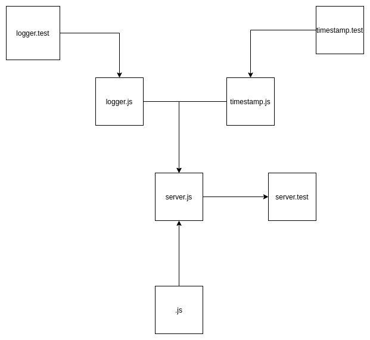

# LAB - 07

## API Server

### Author: Travis Skyles

### Links and Resources
* [submission PR]()
* [travis]()

### Setup

#### How to initialize/run your server app (where applicable)
* `npm start`
* Endpoint: /docs
  * Returns JSdocs
  
#### Tests
* Unit Tests: `npm test`
* Lint Tests: `npm run lint`

#### UML
